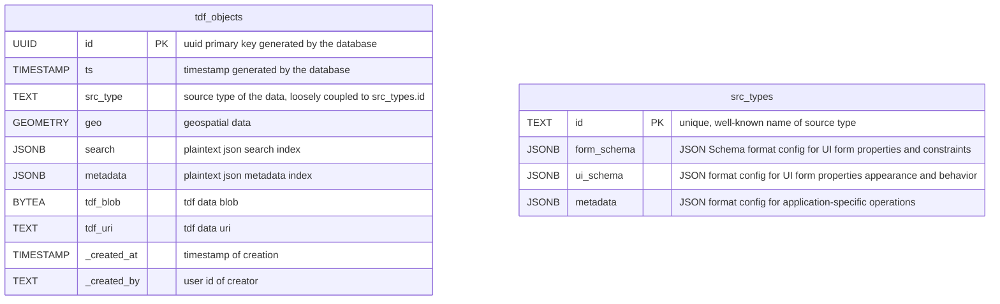

## DSP COP Database Entity Relationship Diagram

```mermaid
erDiagram
    tdf_objects {
        UUID id PK "uuid primary key generated by the database"
        TIMESTAMP ts "timestamp generated by the database"
        TEXT src_type "source type of the data, loosely coupled to src_types.id"
        GEOMETRY geo "geospatial data"
        JSONB search "plaintext json search index"
        JSONB metadata "plaintext json metadata index"
        BYTEA tdf_blob "tdf data blob"
        TEXT tdf_uri "tdf data uri"
        TIMESTAMP _created_at "timestamp of creation"
        TEXT _created_by "user id of creator"
    }

    src_types {
        TEXT id PK "unique, well-known name of source type"
        JSONB form_schema "JSON Schema format config for UI form properties and constraints"
        JSONB ui_schema "JSON format config for UI form properties appearance and behavior"
        JSONB metadata "JSON format config for application-specific operations"
    }
```
