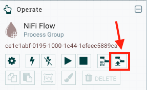
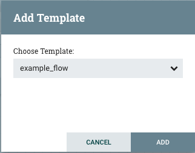
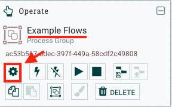
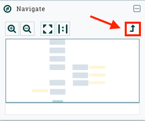
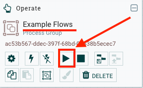

Contains a sample NiFi deployment:
- [custom-libs](./custom-libs) libraries in addition to NiFi libs; e.g. postgres db driver.
- [extensions](./extensions) Custom NiFi NAR Archives to be mounted into NiFi
- [flows](./flows): Saved NiFi flows and template files.
- [processors](./processors): NiFi script processors used in some of the example flows (reference)

The processor supports using the SSLContextService in NiFi to manage self-signed certs.

Example adding all certs in the truststore directory to a jks truststore:

``` shell
./build_truststore.sh
```

List trusted certs
```shell
keytool -list -v -keystore truststore/ca.jks
keytool -list  -keystore truststore/ca.jks

```

Startup:
> Important Note: See the main [README](../README.md#start-required-services) for more details on running the applicaion with nifi enabled. 

Start the docker stack with the following command:
```shell
docker-compose --profile nifi -f docker-compose.dev.yaml --env-file=./env/default.env up
```

# Using the example flow template

## Integrate
1. [Launch NiFi web UI](http://127.0.0.1:18080/nifi)
1. Import the example flow template.
    - 
    - Click the "Upload Template" button and browse to the file: `dsp-cop/nifi/flows/example_flow.xml`
1. Add the example flow to the NiFi workspace
    - 
    - Click and drag the "Add Template" icon from the toolbar to the NiFiworkspace
    - 
    - Select the example template from the dropdown menu and click "ADD"

## Configure
1. Click on the **Example Flow** to select it
    - 
    - Once selected, click the &#9881; icon to configure the flow
1. From the Flow Configuration menu, locate the following Controller Services:
    1. **Example DSP ControllerService**
        - Click the &#9881; icon on the far right to configure the service
        - Set the value for `Client Secret` (if you are using the development stack, enter `secret`)
        - Click Ok, then Apply
        - Click the &#9889; icon to enable the controller service
    1. **Example DSP SSLContextService**
        - Click the &#9881; icon on the far right to configure the service
        - Set the value for `Truststore Password` (if you are using the development stack, enter `password`)
        - Click Ok, then Apply
        - Click the &#9889; icon to enable the controller service
    1. **Mission JsonRecordSetWriter**
        - Click the &#9889; icon to enable the controller service
    1. Exit the Flow Configuration Menu
1. Double Click on **Example Flows** to enter the flow
1. Select the processor named **SaveTDFDataIndex**
    - Click the &#9881; icon to configure the processor's Controller Services
        1. **Example PostGIS DBCPConnectionPool**
            - Click the &#9881; icon on the far right to configure the service
            - Set the value for `Password` (if you are using the development stack, enter `changeme`)
            - Click Ok, then Apply
            - Click the &#9889; icon to enable the controller service
        1. Exit the Flow Configuration Menu
1. Double Click the processor named **Example Flows** to enter the flow
    - Locate the processer named **TDF - GetTags**
        1. Click the &#9881; icon to configure
        1. Select the *Relationships* tab
        1. Check the **terminate** box for `assertion_incomplete`
        1. Click Apply

## Running the Flow
1. Click the Back Arrow until you are all the way back to the NiFi workspace
    - 
1. Click on the **Example Flow** to select it
    - 
    - Navigate back into the **Example Flow** and you will see I/O values change
    - You will also see records in the `tdf_objects` table of your database
